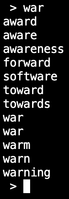
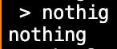
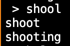

# word-ML-engine
This is an word engine that will reconstruct words and phrases from letters with the help of ML. It essentialy will autocomplete words with missing letters

# How it works
- Has a word bank of 3000 common english words
- does a search for entry inside words
- searches for part of entry inside words
- searches for missing letters
- searches for commonly mixed up letters
- Will do ML part later

# Features

- Searches inside words

 

- Searches for missing letters

 

- finds mixed up letters

